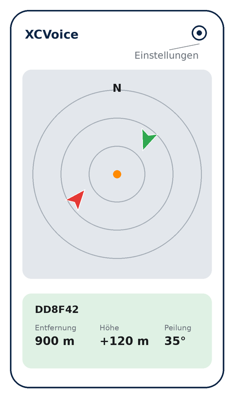
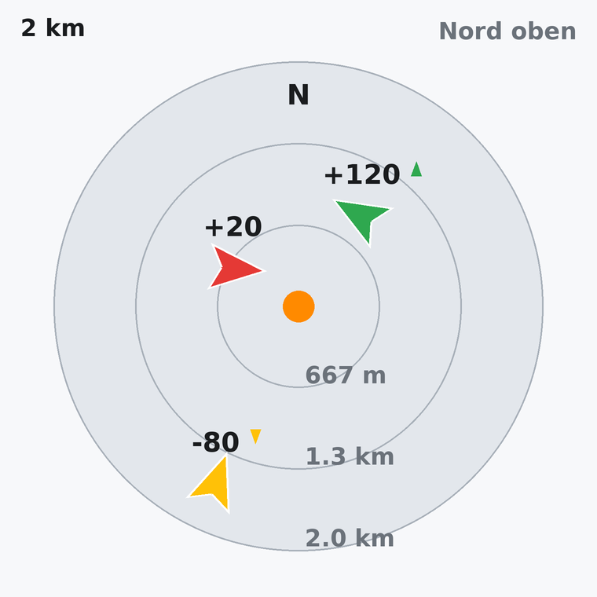
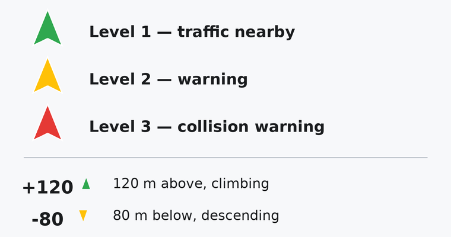
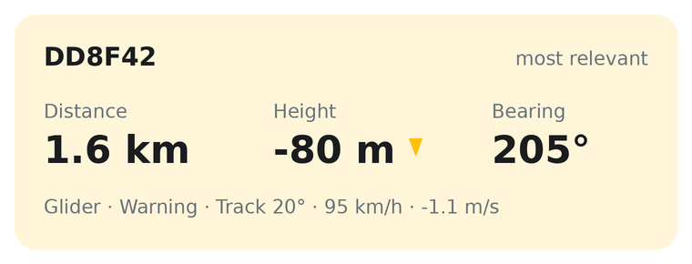

# XCVoice

**FLARM-Verkehrsansagen und Radar für Android**
*FLARM voice traffic alerts and radar for Android*

XCVoice verbindet sich per Bluetooth mit einem FLARM-Gerät und sagt erkannten
Verkehr an — gesprochen, damit der Blick draußen bleiben kann, und als Radarbild,
wenn die ganze Lage gefragt ist.

XCVoice connects to a FLARM device over Bluetooth and tells you where the
traffic is — spoken, so you can keep your eyes outside, and on a radar picture
when you want the full situation.

Von / by [XCNAV](https://xcnav.de) — für Segelflug- und Gleitschirmpiloten.

  

---

> ### ⚠️ Sicherheitshinweis / Safety notice
>
> XCVoice **ergänzt die Luftraumbeobachtung**. Es ist kein Kollisionswarnsystem
> und kein Ersatz für das originale FLARM-Display. Die Verantwortung für
> Ausweichentscheidungen liegt allein beim Luftfahrzeugführer. Verlassen Sie
> sich niemals ausschließlich auf diese App.
>
> XCVoice **supplements visual lookout**. It is not a collision avoidance system
> and not a replacement for the original FLARM display. Responsibility for
> avoidance decisions rests solely with the pilot in command. Never rely on this
> app alone.

---

## 📥 Download

Voraussetzung: **Android 8.0 oder neuer** / Requires **Android 8.0 or newer**

### Installation (Deutsch)

1. Die Datei `xcvoice-x.y.z.apk` auf dem Telefon herunterladen.
2. Auf die heruntergeladene Datei tippen. Android fragt, ob Apps aus dieser
   Quelle installiert werden dürfen — die Erlaubnis für den verwendeten Browser
   erteilen.
3. Auf **Installieren** tippen.
4. Beim ersten Start die Berechtigungen für Bluetooth und Benachrichtigungen
   erteilen. Ohne sie kann keine Verbindung aufgebaut werden.
5. Das FLARM-Gerät einmalig in den Android-Bluetooth-Einstellungen koppeln.
   XCVoice wählt es danach selbstständig aus.

### Installation (English)

1. Download `xcvoice-x.y.z.apk` on your phone.
2. Tap the downloaded file. Android will ask whether apps from this source may
   be installed — grant the permission for the browser you used.
3. Tap **Install**.
4. On first launch, grant the Bluetooth and notification permissions. Without
   them no connection can be established.
5. Pair the FLARM device once in the Android Bluetooth settings. XCVoice picks
   it up automatically from then on.

## 📖 Handbuch / Manual

Die vollständige Anleitung in Deutsch und Englisch:
The complete manual in German and English:

**[➜ XCVoice-Handbuch-Manual.pdf](docs/XCVoice-Handbuch-Manual.pdf)**

## Funktionen / Features

### Sprachansagen / Voice announcements

Eine Ansage lässt sich aus Alarmtyp, Flugzeugtyp, relativer Entfernung und
Höhendifferenz zusammenstellen. Für die Richtung gibt es zwei Varianten, die
sich gegenseitig ausschließen:

- **Uhrzeit-Peilung** — die klassische Ansage, z. B. *„drei Uhr"*
- **Richtungsansage** — in Worten, z. B. *„vorne rechts, oben"*

Welche FLARM-Alarmstufen überhaupt angesagt werden, ist frei wählbar.

Announcements can be built from alarm type, aircraft type, relative distance and
height difference. Direction is announced either as a **clock position**
(*"three o'clock"*) or as a **direction callout** (*"front right, above"*).
Which FLARM alarm levels are announced at all is up to you.

**Wiederholungen / Repeat throttling.** Ein FLARM meldet dasselbe Ziel mehrmals
pro Sekunde. Jedes Ziel hat deshalb eine Sperrzeit nach Alarmstufe: 45 s bei
Stufe 1, 20 s bei Stufe 2, 10 s bei Stufe 3. Steigt die Alarmstufe an, wird
sofort angesagt und eine laufende Ansage unterbrochen.

### Radar

  

- Eigene Position in der Mitte, drei beschriftete Entfernungsringe
- Verkehr als Pfeile in Flugrichtung, farbig nach Alarmstufe
- Höhendifferenz und Steig-/Sinkzeichen an jedem Ziel
- **Zwei Finger zusammen/auseinander:** Reichweite 500 m bis 20 km
- **Lang drücken:** Nord oben / Kurs oben umschalten
- **Antippen:** Details zum Ziel

  

### Infofenster / Info panel

  

Ohne Auswahl zeigt es automatisch das wichtigste Ziel: höchste Alarmstufe
zuerst, bei gleicher Stufe das nächstgelegene.

Without a selection it automatically shows the most relevant traffic — highest
alarm level first, nearest one within the same level.

## Problembehebung / Troubleshooting

**Die deutsche Ansage klingt englisch.** Auf dem Telefon fehlen die deutschen
Sprachdaten, Android liest den Text mit einer fremdsprachigen Stimme vor.
XCVoice erkennt das und zeigt in den Einstellungen einen Hinweis; ein Tippen
darauf führt in die Android-Einstellungen für die Sprachausgabe.

*Announcements read with the wrong accent:* the matching voice data is not
installed. Tap the notice in the settings to open the Android text-to-speech
settings and download the correct voice.

**Keine Verbindung / No connection.** Ist das FLARM eingeschaltet und in den
Android-Bluetooth-Einstellungen gekoppelt? Steht der Hauptschalter oben in den
Einstellungen auf ein?

**Ziele im Radar, aber keine Ansagen.** Die betreffende Alarmstufe ist in den
Einstellungen nicht angehakt.
*Targets on the radar but no announcements:* that alarm level is not ticked.

**App wird beendet, sobald der Bildschirm ausgeht.** In den Android-Einstellungen
die Akku-Optimierung für XCVoice deaktivieren.
*The app stops when the screen turns off:* disable battery optimisation for
XCVoice.

## Rückmeldungen / Feedback

Fehler und Wünsche gerne als [Issue](../../issues). Hilfreich sind dabei
Telefonmodell, Android-Version und FLARM-Modell.

Please open an [issue](../../issues) for bugs and feature requests. The phone
model, Android version and FLARM model help a lot.

---

© XCNAV · [xcnav.de](https://xcnav.de) · Alle Rechte vorbehalten / All rights reserved
