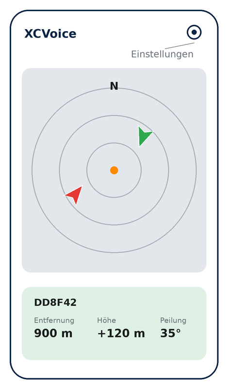
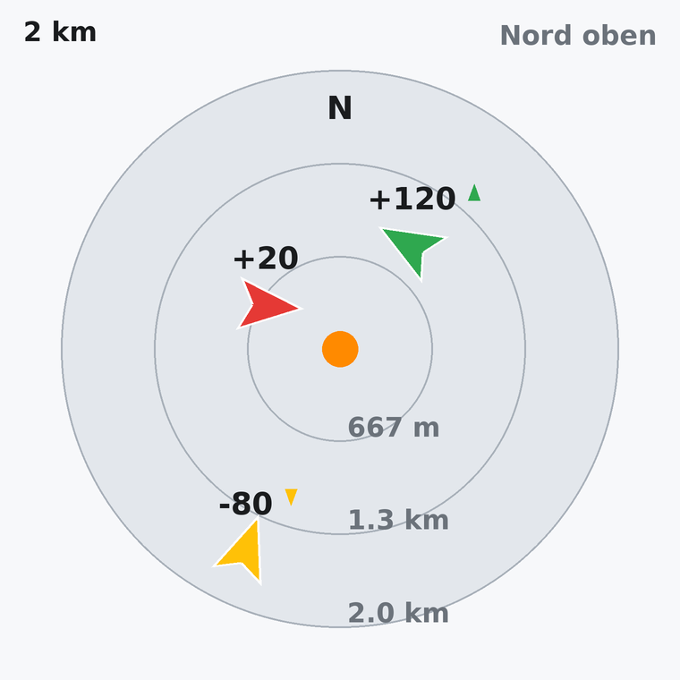
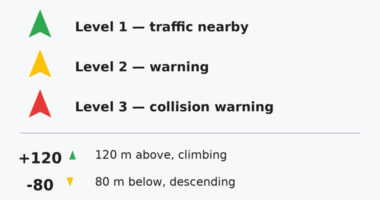
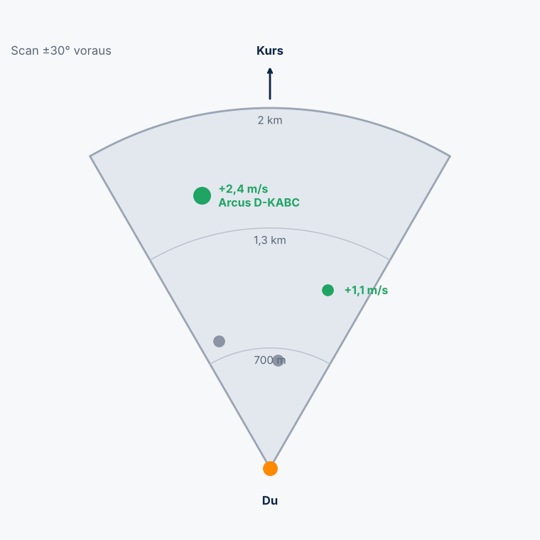
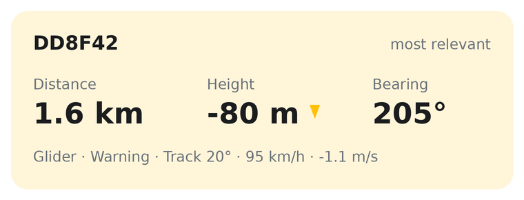

# XCVoice

**FLARM-Verkehrsansagen und Radar für Android**
*FLARM voice traffic alerts and radar for Android*

XCVoice verbindet sich per Bluetooth, BLE oder WiFi TCP mit einem FLARM-Gerät und sagt erkannten
Verkehr an — gesprochen, damit der Blick draußen bleiben kann, und als Radarbild,
wenn die ganze Lage gefragt ist. Neu in **Version 6.0**: der **Scan-Modus**, der
voraus nach dem besten Aufwind sucht.

XCVoice connects to a FLARM device over Bluetooth, BLE or WiFi TCP and tells you where the
traffic is — spoken, so you can keep your eyes outside, and on a radar picture
when you want the full situation. New in **version 6.0**: the **scan mode**, which
looks ahead for the best lift.

Von / by [XCNAV](https://xcnav.de) — für Segelflug- und Gleitschirmpiloten.

  

---

> ### ⚠️ Sicherheitshinweis / Safety notice
>
> XCVoice **ergänzt die Luftraumbeobachtung**. Es ist kein Kollisionswarnsystem
> und kein Ersatz für das originale FLARM-Display. Die Verantwortung für
> Ausweichentscheidungen liegt allein beim Luftfahrzeugführer. Verlassen Sie
> sich niemals ausschließlich auf diese App.
>
> XCVoice **supplements visual lookout**. It is not a collision avoidance system
> and not a replacement for the original FLARM display. Responsibility for
> avoidance decisions rests solely with the pilot in command. Never rely on this
> app alone.

---

## 📥 Download

Voraussetzung: **Android 8.0 oder neuer** / Requires **Android 8.0 or newer**

### Installation (Deutsch)

1. Oben rechts auf dieser Seite auf **„Releases"** klicken (oder direkt:
   [github.com/XCNav/XCVoice/releases](https://github.com/XCNav/XCVoice/releases)).
   Den **neuesten Eintrag ganz oben** öffnen und unter **„Assets"** die Datei
   `xcvoice-x.y.z.apk` herunterladen. **Nicht** den grünen **„Code"**-Button
   oben auf dieser Seite verwenden — der lädt nur den Quellcode herunter,
   keine installierbare App.
2. Auf die heruntergeladene Datei tippen. Android fragt, ob Apps aus dieser
   Quelle installiert werden dürfen — die Erlaubnis für den verwendeten Browser
   erteilen.
3. Auf **Installieren** tippen.
4. Beim ersten Start die Berechtigungen für Bluetooth und Benachrichtigungen
   erteilen. Ohne sie kann keine Verbindung aufgebaut werden.
5. Bluetooth: Das FLARM-Gerät einmalig in den Android-Bluetooth-Einstellungen
   koppeln, XCVoice wählt es danach selbstständig aus. WLAN: Das Telefon im
   WLAN des Geräts anmelden (Voreinstellung 192.168.4.1, Port 4352).
6. *Optional, für die Tasten L und O (z. B. XCRemote) auch bei anderer App im
   Vordergrund:* Bedienungshilfen-Dienst „XCVoice" aktivieren. Bei einer
   Installation außerhalb des Play Store (Android 13+) vorher unter
   **Einstellungen → Apps → XCVoice → ⋮ → „Eingeschränkte Einstellungen
   zulassen"** wählen. Die genaue Anleitung steht im Handbuch.

### Installation (English)

1. Click **"Releases"** at the top right of this page (or go directly to
   [github.com/XCNav/XCVoice/releases](https://github.com/XCNav/XCVoice/releases)).
   Open the **newest entry at the top** and download the `xcvoice-x.y.z.apk`
   file under **"Assets"**. **Do not** use the green **"Code"** button at the
   top of this page — that only downloads the source code, not an installable
   app.
2. Tap the downloaded file. Android will ask whether apps from this source may
   be installed — grant the permission for the browser you used.
3. Tap **Install**.
4. On first launch, grant the Bluetooth and notification permissions. Without
   them no connection can be established.
5. Bluetooth: pair the FLARM device once in the Android Bluetooth settings;
   XCVoice picks it up automatically from then on. WiFi: join the device's
   WiFi network (default 192.168.4.1, port 4352).
6. *Optional, for the L and O keys (e.g. XCRemote) while another app is in the
   foreground:* enable the accessibility service "XCVoice". For installs outside
   the Play Store (Android 13+) first choose **Settings → Apps → XCVoice → ⋮ →
   "Allow restricted settings"**. Detailed steps are in the manual.

## 📖 Handbuch / Manual

Die vollständige Anleitung in Deutsch und Englisch:
The complete manual in German and English:

**[➜ XCVoice Handbuch/Manual](XCVoice-Handbuch-Manual.pdf)**

## Funktionen / Features

### Sprachansagen / Voice announcements

Eine Ansage lässt sich aus Alarmtyp, Flugzeugtyp, relativer Entfernung und
Höhendifferenz zusammenstellen. Für die Richtung gibt es zwei Varianten, die
sich gegenseitig ausschließen:

- **Uhrzeit-Peilung** — die klassische Ansage, z. B. *„drei Uhr"*
- **Richtungsansage** — in Worten, z. B. *„vorne rechts, oben"*

Welche FLARM-Alarmstufen überhaupt angesagt werden, ist frei wählbar. Die
Einstellungen gelten **je Alarmstufe** (Langdruck auf die Stufe).

Alle Richtungsangaben beziehen sich auf die **eigene Flugrichtung**, nicht auf
Nord: „rechts" heißt rechts von deiner Nase. Die angesagte Steigrate ist der
**Mittelwert der letzten bis zu 30 Sekunden**, kein einzelner Messwert.

Announcements can be built from alarm type, aircraft type, relative distance and
height difference. Direction is announced either as a **clock position**
(*"three o'clock"*) or as a **direction callout** (*"front right, above"*).
Which FLARM alarm levels are announced at all is up to you. Settings apply **per
alarm level** (long-press the level).

All directions are relative to **your own heading**, not north: "right" means
right of your nose. The announced climb rate is the **average of the last up to
30 seconds**, not a single reading.

**Wiederholungen / Repeat throttling.** Ein FLARM meldet dasselbe Ziel mehrmals
pro Sekunde. Jedes Ziel hat deshalb eine Sperrzeit nach Alarmstufe: 45 s bei
Stufe 1, 20 s bei Stufe 2, 10 s bei Stufe 3. Steigt die Alarmstufe an, wird
sofort angesagt und eine laufende Ansage unterbrochen.

**Thermik-Modus (optional).** Beim gemeinsamen Kreisen bleibt die Alarmstufe oft
minutenlang gleich. Ist der Thermik-Modus an, wird ein Ziel **nur während du
tatsächlich kreist** (≥ 210° Kursänderung in 20 s) erst dann erneut angesagt,
wenn sich Entfernung (≥ 50 m) oder Höhe (≥ 30 m) merklich geändert haben, dazu
eine Erinnerung nach 90 s. Im Geradeausflug gelten die normalen Sperrzeiten.

**Tasten (z. B. XCRemote):** **L** pausiert/setzt die Verkehrsansage fort,
**O** bricht die laufende Ansage ab.

*Thermal mode (optional):* while circling together, the alarm level often stays
the same for minutes. With thermal mode on, a target is — **only while you are
actually circling** (≥ 210° heading change in 20 s) — re-announced only when its
distance (≥ 50 m) or height (≥ 30 m) has changed noticeably, plus a reminder after
90 s. On straight glide the normal cooldowns apply. *Keys (e.g. XCRemote):* **L**
pauses/resumes traffic announcements, **O** cancels the current announcement.

### Radar

  

- Eigene Position in der Mitte, drei beschriftete Entfernungsringe
- Verkehr als Pfeile in Flugrichtung, farbig nach Alarmstufe
- Höhendifferenz und Steig-/Sinkzeichen an jedem Ziel
- **Hoch/runter wischen:** Reichweite 500 m bis 20 km, **eine Stufe pro Wisch**
- **Links/rechts wischen:** zwischen Radar und Scan-Modus wechseln
- **Lang drücken:** Nord oben / **Kurs oben** (Standard) umschalten
- **Antippen:** Details zum Ziel; das Ziel wird zusätzlich angesagt
- Ein rotes **K?** bedeutet: noch kein eigener Kurs empfangen (kommt aus den
  GPS-Daten des FLARM, GPRMC/GPVTG)

*Swipe up/down:* range 500 m to 20 km, one step per swipe. *Swipe left/right:*
switch between radar and scan mode. *Long press:* north up / **heading up**
(default). *Tap:* target details, and the target is announced. A red **K?** means
no own track received yet (taken from the FLARM's GPS sentences).

  

### Scan-Modus / Scan mode (neu in 6.0 / new in 6.0)

  

Zweite Seite neben dem Radar (**nach links wischen**): Sie blickt nur **nach
vorn** und zeigt Luftfahrzeuge in einem Sektor um den eigenen Kurs
(Standard ±30°, einstellbar 15–60°). Die Tiefe entspricht der Zoomstufe.

- Steigende Ziele (≥ 0,5 m/s) zeigen ihren **Mittelwert der letzten Minute** in Grün
- Liste unter dem Bild, **bester Steiger zuerst**
- **Ansage des besten Steigers** (ab 1,0 m/s, nur solange die Scan-Seite offen
  ist), z. B. *„Bester Steiger. Steigen 2,4 Meter. Arcus. D K A B C. vorne rechts.
  Entfernung 1,2 Kilometer."*
- **OGN-Abfrage:** Typ und Kennzeichen aus der OGN-Gerätedatenbank
  ([ddb.glidernet.org](https://ddb.glidernet.org)). Einmaliger Download mit
  Internet, danach offline aus dem Zwischenspeicher; Kennzeichen nur bei vom
  Halter freigegebenen Geräten. Im WLAN des FLARM-Geräts gibt es meist kein
  Internet — die Datenbank daher einmal vor dem Flug laden.
- Einstellungen unter **Scan (Vorausschau)**: Sektorwinkel, Ansage, OGN-Abfrage

A second page next to the radar (**swipe left**) that looks only **ahead** and
shows aircraft in a sector around your track (default ±30°, adjustable 15–60°);
depth equals the zoom range. Climbing targets (≥ 0.5 m/s) show their **one-minute
average** in green, listed best climber first. While the scan page is open, XCVoice
announces the **best climber** (from 1.0 m/s), e.g. *"Best climber. Climbing 2.4
metres. Arcus. D K A B C. front right. Distance 1.2 kilometres."* With **OGN
lookup**, type and registration come from the OGN device database (one-time
download, then cached offline; registrations only for devices released by their
owner). The FLARM's own WiFi usually has no internet, so load the database once
before flying. Settings under **Scan (look ahead)**.

### Infofenster / Info panel

  

Ohne Auswahl zeigt es automatisch das wichtigste Ziel: höchste Alarmstufe
zuerst, bei gleicher Stufe das nächstgelegene.

Without a selection it automatically shows the most relevant traffic — highest
alarm level first, nearest one within the same level.

## Problembehebung / Troubleshooting

**Die deutsche Ansage klingt englisch.** Auf dem Telefon fehlen die deutschen
Sprachdaten, Android liest den Text mit einer fremdsprachigen Stimme vor.
XCVoice erkennt das und zeigt in den Einstellungen einen Hinweis; ein Tippen
darauf führt in die Android-Einstellungen für die Sprachausgabe.

*Announcements read with the wrong accent:* the matching voice data is not
installed. Tap the notice in the settings to open the Android text-to-speech
settings and download the correct voice.

**Keine Verbindung / No connection.** Ist das FLARM eingeschaltet und in den
Android-Bluetooth-Einstellungen gekoppelt? Steht der Hauptschalter oben in den
Einstellungen auf ein?

**Ziele im Radar, aber keine Ansagen.** Die betreffende Alarmstufe ist in den
Einstellungen nicht angehakt.
*Targets on the radar but no announcements:* that alarm level is not ticked.

**App wird beendet, sobald der Bildschirm ausgeht.** In den Android-Einstellungen
die Akku-Optimierung für XCVoice deaktivieren. Solange XCVoice im Vordergrund ist,
bleibt der Bildschirm von selbst an.
*The app stops when the screen turns off:* disable battery optimisation for
XCVoice. While XCVoice is in the foreground the screen stays on by itself.

**Kurs oben dreht sich nicht, oben steht „K?".** Das FLARM sendet keine
GPS-Kursdaten (GPRMC/GPVTG) an die App, etwa weil die Ausgabe am Gerät oder
Adapter gefiltert wird. Ohne Kurs arbeiten auch Scan-Modus und
Thermik-Modus nicht.
*Heading up does not rotate, "K?" shown:* the FLARM is not passing GPS track
sentences (GPRMC/GPVTG) to the app, e.g. filtered by the device or adapter. Without
a track the scan and thermal modes cannot work either.

**Tasten L/O wirken nur in XCVoice.** Den Bedienungshilfen-Dienst aktivieren;
bei Installation außerhalb des Play Store zuerst „Eingeschränkte Einstellungen
zulassen" (siehe Installation).
*L/O keys only work inside XCVoice:* enable the accessibility service; for installs
outside the Play Store allow restricted settings first (see installation).

## Rückmeldungen / Feedback

Fehler und Wünsche gerne als [Issue](../../issues). Hilfreich sind dabei
Telefonmodell, Android-Version und FLARM-Modell.

Please open an [issue](../../issues) for bugs and feature requests. The phone
model, Android version and FLARM model help a lot.

---

© XCNAV · [xcnav.de](https://xcnav.de) · Alle Rechte vorbehalten / All rights reserved
